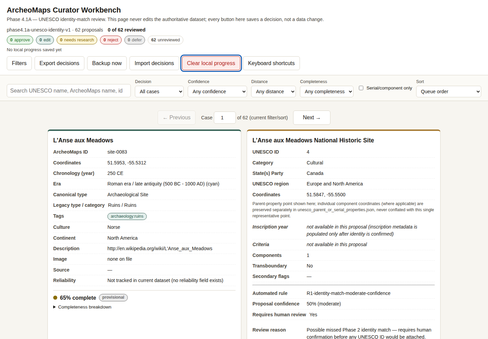
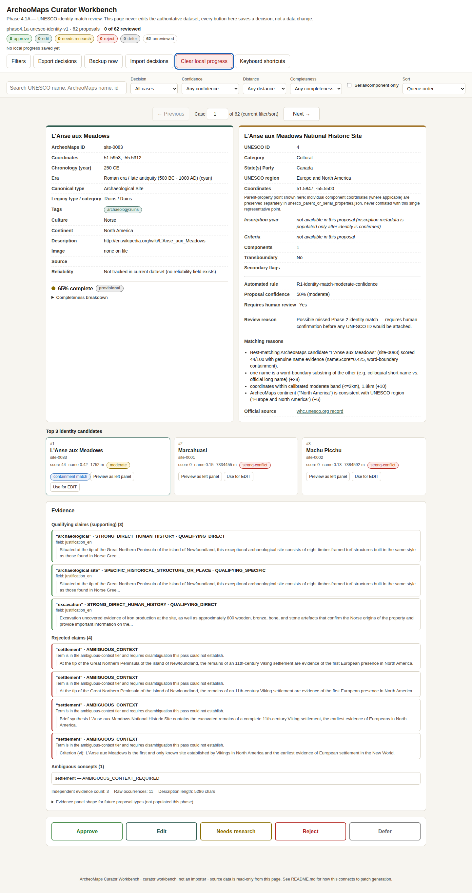
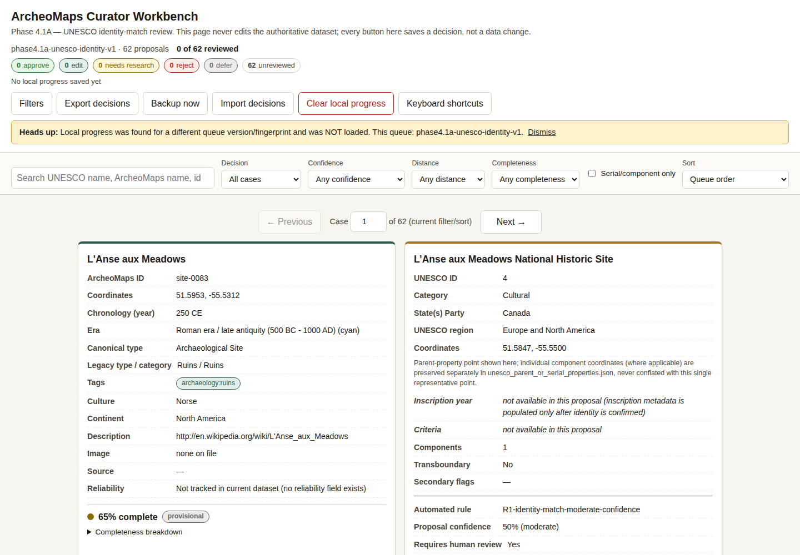
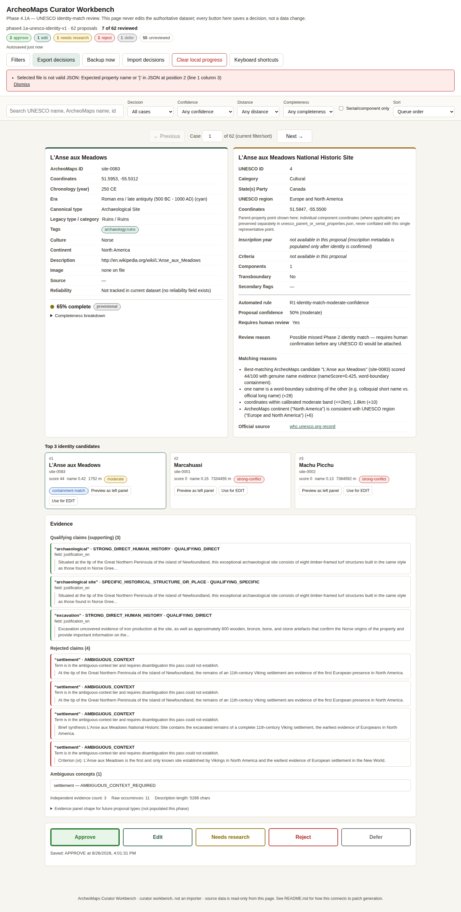
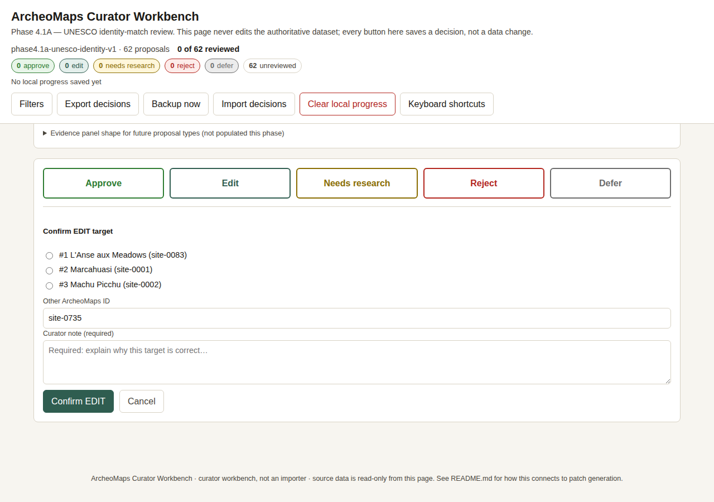
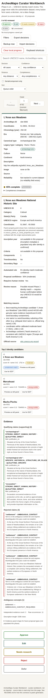
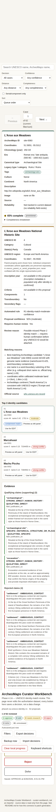
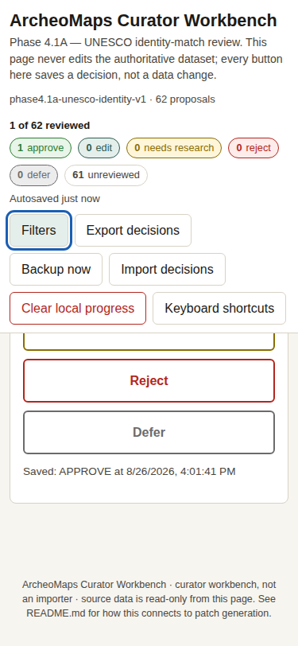

# Manual Visual-Check Report — ArcheoMaps Curator Workbench (Phase 4.1A)

Browser automation (Playwright/Chromium, headless) was available in this
environment, so the checks below are **automated + screenshot-verified**,
not purely manual. `tests/manual-browser-check.js` (orchestrated by
`tests/run-checks.js`) drives a real Chromium instance against the real
2,103-record dataset and the real 62-proposal queue, and captures the
screenshots referenced here as part of that same run. See
`test-output/browser-check-transcript.txt` for the full 34/34-check pass
log this report is based on.

## Desktop (1440×1000 viewport)

Confirmed:
- Header shows queue version, progress ("N of 62 reviewed"), five decision
  count badges, autosave status, and the toolbar (Filters, Export, Backup,
  Import, Clear progress, Keyboard shortcuts).
- Two-column comparison: ArcheoMaps record (left, green top border) vs.
  UNESCO proposal (right, gold top border).
- Completeness indicator (dot + percentage + "provisional" chip) visible
  at the bottom of the left panel.
- UNESCO inscription year / criteria correctly rendered in italics as
  "not available in this proposal" rather than fabricated or silently
  omitted.

Confirmed further down the page: the top-3 candidate strip, the evidence
panel (qualifying claims / rejected claims / ambiguous concepts /
evidence stats), and the five large decision buttons (Approve, Edit,
Needs research, Reject, Defer). **v1.1 note:** this screenshot is taken
after a full interaction pass (decisions made, an import attempted, then
"Clear local progress" clicked) and confirms the page returns to a clean
initial state — "0 of 62 reviewed", no stray banners. An earlier version
of this screenshot incorrectly showed a leftover "Selected file is not
valid JSON" banner still on screen after Clear local progress, because
the import-result banner had no dismiss affordance and nothing cleared
it on unrelated actions. Fixed in `curator.js`: `clearLocalProgress()`
now clears the import-result banner, and the banner itself got an
explicit Dismiss button (visible in the error-state screenshot below) so
it never lingers regardless of what the curator does next.

Confirmed: when `localStorage` contains progress saved under a
**different** queue-version/fingerprint namespace, a dismissible warning
banner appears and the current queue still starts at "0 of 62 reviewed"
— the foreign progress is never silently loaded.

## Error-state test (explicitly labeled, not the initial/default view)

This screenshot **intentionally** triggers an error: a malformed JSON
file was selected via "Import decisions" to verify the error banner
renders correctly and is dismissible (note the "Dismiss" link inside the
banner, and that this state is reached mid-review at "7 of 62 reviewed"
with visible decisions already made — not the fresh-load state). This is
a deliberate negative-path check, included here so the failure mode is
documented, not because it represents normal operation. Compare against
`desktop-full-page.png` above, which confirms the same page returns to a
clean state with no banner once the curator moves on.

## Free-typed EDIT dataset-integrity check (section 5)

Confirmed end-to-end in a real browser (`tests/test-lazy-dataset-fetch.js`):
typing a free-text ArcheoMaps ID not among a proposal's pre-embedded
top-3 candidates triggers a one-time lazy fetch of the full authoritative
dataset, verified against the sha256 `review_queue.json` recorded for
the dataset it was generated from. When the deployed file matches, the
preview renders correctly. When it doesn't (simulated by serving a
byte-different file at the same configured filename), the fetch is
**rejected** with a clear on-page error — never silently substituted.

## Mobile (375×812 viewport, `isMobile: true`)

Confirmed via actual DOM bounding-box comparison (not just visual
inspection): the left and right comparison panels stack vertically
(same x-offset, right panel's y-offset below the left panel's), matching
the `@media (max-width: 860px)` rule in `curator.css`. Toolbar buttons
wrap onto multiple rows. Text remains readable without horizontal
scrolling.

Confirmed: tapping a decision button works identically to desktop, header
counts update, autosave status updates — all on the mobile viewport.

Confirmed: the collapsible filter bar toggles open/closed via the
"Filters" button and its controls remain usable at 375px width.

## Accessibility spot-checks

- All interactive controls are `<button>`, `<input>`, `<select>`, or
  `<a>` elements with visible text labels (no icon-only buttons).
- Focus outline (`outline: 3px solid var(--focus)`) is applied globally
  to buttons, inputs, selects, textareas, and links via `:focus`, and is
  never suppressed.
- Completeness and confidence are communicated with a color dot **and**
  a text label/percentage side by side — never color alone.
- A skip link ("Skip to case content") is present as the first focusable
  element on the page.

## Known limitation of this pass

This was not a screen-reader or full WCAG audit — it verifies structural
accessibility affordances (labels, focus states, non-color-only
signaling) rather than assistive-technology behavior end-to-end. A full
screen-reader pass is recommended before Phase 4.1B if this tool remains
in active use beyond the initial 62-item queue.
